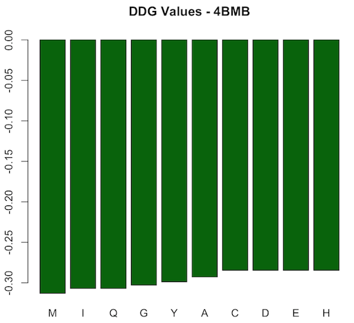
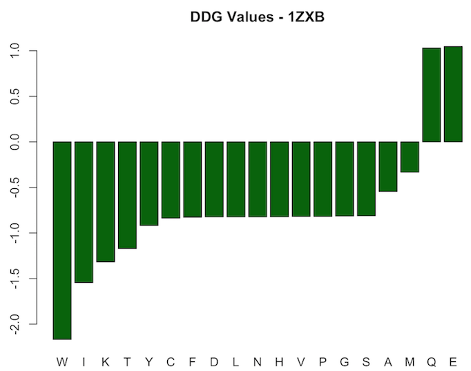

Project Title
------------------

Structure Analysis | Mutation F19Y is found in Karl Zimmer’s genome for 4BMB (galectin-8). Analyze the structure of this mutation.

Table of Contents
-----------------------

**Contributors**
 -Writing:
 -Coding:
 -Pipeline: Hussein Mohsen

### Introduction:

### Writing:

### Coding:

#### Documentation:

#### Results:

### Pipeline: 
Download the 4BMB structure from the Protein DataBank. Using the Rosetta Software Suite, generate 10 different protein mutations at location 19 (choose 10 of the 20 amino acids). Obtain the relaxed protein structure following each mutation from Rosetta and compare the energy of the resulting structures. Which mutant is most stabilizing and which is most destabilizing? Why do you think this is the case?

#### Documentation:

We installed [Rosetta 2017.08](https://www.rosettacommons.org/software/license-and-download) on a macOS machine. To calculate the difference of energy after introducing point mutations, we modified the [calculate protein protein ddg demo](https://www.rosettacommons.org/demos/latest/public/calculate_protein_protein_ddg/README) as necessary to work on the 4BMB PDB file. The main steps are: (1) Relaxing the protein PDB file, (2) Repacking the structure, (3) Calculating Delta G of the wild type protein, (4) Repacking the structure with a point mutation at position 19, (5) Calculating Delta G' of the mutated protein, (6) Calculating the change in binding energy.

To execute (1), we used the following command:

*relax.default.macosclangrelease -s 4bmb.pdb -ignore_unrecognized_res -out:path:pdb results -out:file:scorefile results/relax_4bmb.sc -nstruct 1*

We renamed the resulting relaxed PDB file to 4bmb_relaxed.pdb. To execute steps (2)-(5), we used the following command:

*rosetta_scripts.default.macosclangrelease -parser:protocol mutation_script.xml -s 4bmb_relaxed.pdb -ignore_unrecognized_res -out:path:pdb results -out:path:score results -nstruct 1*

Delta G of each of the wild and mutant type proteins appear at the end of the final PDB file. To perform step (6) and calculate the change in binding energe, we use the following command:

*tail -n 3 4bmb_relaxed_M.pdb | awk 'BEGIN{i=0}{if($2 != "") {a[i] = $2; i++}}END{print a[0]-a[1]}'*

The command above is an example that corresponds to the PDB file after introducing point mutation M at point 19.

Please not that samples files necessary to reproduce results are submitted to the repository (in Pipeline directory). Files correspond to point mutation M at position 19. Namely, these files are 4bmb_relaxed.pdb, 4bmb-mutM.resfile, and mutation_script. Sample output file, 4bmb_relaxed_M.pdb, is also submitted. Wild type PDB file of 4BMB can be downloaded from RCSB Protein Data Bank [here](http://www.rcsb.org/pdb/explore.do?structureId=4BMB).

To rerun all commands successfully, the most recent version of Rosetta as of May 8, 2017 (Rosetta 2017.08) should be used. Rosetta undergoes weekly releases and demos, movers, and protocols are often subject to change.

In addition to running the pipeline to introduce 10 point mutations at position 19 in protein 4BMB, we generated the results with 19 different point mutations (all possible AA single point substitutions) in another protein, namely 1ZXB.

#### Results:

For protein 4BMB, the difference in binding energy (ddG) after introducing the mutation is always negative. However, values vary as shown in the first figure below. The lowest value corresponds to M mutation (-0.31306) and highest to each of C, D, E, and H (-0.28465). Accordingly, all of the mutations are stabilizing ones. The most stabilizing corresponds to M, and the most destabilizing, or in fact the least stabilizing, corresponds to each of the five amino acids C, D, E, and H. The definition of stabilizing (ddG<0) and destabilizing (ddG>0) in terms of the difference in binding energy can be found in paper [1].

According to the FASTA sequence of 4BMB downloaded from its PDB record, the amino acid at position 19 in the wild type protein is T, which is a very hydrophobic acid at pH = 2 and pH = 7 according to lectures by Professor O'Hern (slide 7, lecture 1). The most stabilizing mutation corresponds to M, which is also in the very same category and is the closest to T. That would be a significant reason behind M being the most stabilizing mutation, as both T and M are very hydrophobic and have similar chemical structure. Both amino acids tend to be very repelled from water, are composed mostly of carbon and hydrogen, and have very small dipole moments [2]. Other amino acids mentioned above are also hydrophobic, but their chemical structure is not as close to T's and accordingly are classified as "hydrophobic" instead of "very hydrophobic." Furthermore, in paper [1], authors suggest that this kind of mutation might be responsible to not only changing the stability of a protein, but also changing its function.

For protein 1ZXB, results resemble a different pattern. Most mutations at point 19 lead to negative change in binding energy, i.e. were stabilizing mutations. However, the two mutations corresponding to Q and E are destabilizing ones and lead to positive one. Values range from -2.1682 to 1.0467. Results are shown in the figure below.

#### Conclusions:

- Replacing a "very hydrophobic" amino acid with another might lead to the highest stabilizing effect in 4BMB
- Point mutations at position 19 (for 10 different amino acids) in 4BMB lead to further stabilization of the protein
- Point mutations in proteins can lead to either stabilization or destabilization of the structure
- Changes in stability resulting from point mutations might lead to changes in (or loss of) a protein's function [1]

#### References:

[1] Y. Bromberg and B. Rost (2009). Correlating protein function and stability through the analysis of single amino acid substitutions. BMC Bioinformatics, 10(S8).
 
[2] Biomolecules: Protein 1, University of Wisconsin-Madison. Retrieved on May 8, 2017 from: https://www.chem.wisc.edu/deptfiles/genchem/netorial/modules/biomolecules/modules/protein1/prot13.htm

